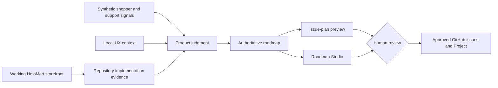

# HoloMart · Copilot for Product demo kit

## Product Track: From Repo Insight to Roadmap Action

HoloMart is a fictional e-commerce marketplace for Pokémon TCG singles. The working demo lets shoppers search synthetic card listings by Pokémon, expansion, and rarity; compare price, condition, seller reputation, and market context; add cards to a demo cart; export the catalog; and save searches in the current browser.

The product story deliberately stops at an honest boundary: **Saved Searches works locally, but account sync and price alerts do not exist yet.** The demo uses GitHub Copilot to answer three product questions from repository evidence:

1. What is already built?
2. What could break or mislead shoppers?
3. What work and decisions come next?

> **Safety and provenance:** HoloMart, every listing, price, seller, rating, quote, metric, and roadmap item is **SYNTHETIC / DEMO-ONLY**. Pokémon names are used only to illustrate the marketplace concept. No card artwork, real customer data, credentials, payment details, or production integrations are included.

## Quick start

Requirements: Git, npm, the GitHub Copilot app/CLI, and Node.js 20.19.0–20.x, 22.13.0–22.x, or 24.0.0 and newer (`^20.19.0 || ^22.13.0 || >=24.0.0`).

From a clean checkout, install the locked dependencies and the Chromium browser used by Playwright:

```powershell
node --version
npm ci
npx playwright install chromium
npm run demo:check
npm start
```

On Linux and in CI, use `npx playwright install --with-deps chromium` so required system packages are installed with the browser.

Open <http://127.0.0.1:4173>.

Useful demo commands:

```powershell
npm run validate
npm run issues:preview
npm run issues:preview:json
npm run demo:reset
```

## Test contract

The test layers are deliberately separate:

For how prompts, agents, skills, the QA Change-Risk canvas, conventional CI, and the pull-request agentic workflow fit together, see the [QA architecture and pipeline](docs/qa-architecture.md).

| Layer | Implementation boundary |
| --- | --- |
| Unit | `test/unit/**/*.test.js`, selected by `vitest.unit.config.js`, runs module-level filter, URL state, CSV, and browser-local Saved Searches behavior in Vitest's Node environment. |
| Integration | `test/integration/**/*.test.js`, selected by `vitest.integration.config.js`, assembles repository components: storefront markup and JavaScript in jsdom, the local HTTP server, reset and issue-preview scripts, and Roadmap Studio. |
| End to end | `test/e2e/**/*.spec.js`, selected by `playwright.config.js`, starts `node scripts/serve.mjs` at `127.0.0.1:4173` and exercises the rendered demo in Chromium. |

Run the layers locally:

| Command | What it runs |
| --- | --- |
| `npm test` | Unit, then integration tests; it does not run end-to-end tests. |
| `npm run test:unit` | Unit tests only. |
| `npm run test:unit:coverage` | Unit tests with reports in `coverage/unit`. |
| `npm run test:integration` | Integration tests only. |
| `npm run test:integration:coverage` | Integration tests with reports in `coverage/integration`. |
| `npm run test:e2e` | Playwright end-to-end tests; the configured local server starts automatically. |
| `npm run test:all` | Unit, integration, then end-to-end tests. |
| `npm run demo:check` | Repository artifact validation, unit and integration tests, then a deterministic JSON issue-plan preview; it does not run end-to-end tests or coverage. |

Playwright writes its HTML report to `playwright-report` and run artifacts such as retained failure screenshots, traces, and videos to `test-results`. Coverage reports are baseline artifacts only: no percentage threshold is enforced yet, and adopting one is a future human decision.

Pushes and pull requests run four independent workflows/checks as committed:

- **Repository validation** — validates repository artifacts and generates the deterministic issue-plan preview.
- **Unit tests** — runs unit coverage and uploads `coverage/unit`.
- **Integration tests** — runs integration coverage and uploads `coverage/integration`.
- **E2E tests** — installs Chromium with Linux dependencies, runs Playwright, and uploads `playwright-report` and `test-results` on failure.

Every layer stays inside the **SYNTHETIC / DEMO-ONLY** boundary: tests use repository-owned fixtures and local processes, with no external services or real shopper, seller, payment, inventory, or pricing data. Passing tests supports deterministic demo behavior; it is not proof of real shopper outcomes or production readiness.

## Demo narrative

The current storefront makes the product scenario concrete:

- Collectors repeatedly rebuild narrow card searches while inventory and price change.
- A browser-local shortcut reduces setup and is intentionally visible as a preview.
- Stale expansion or rarity criteria can undermine trust if recovery is silent.
- Account sync creates durable-data lifecycle work.
- Price alerts require separate evidence, freshness rules, and explicit notification consent.



## 45-minute map

| Time | Move | Proof |
| --- | --- | --- |
| 0–5 | Frame the collector problem in the working storefront | `app/`, `product/brief.md` |
| 5–13 | Ask what Saved Searches already implements | cited code/test capability matrix |
| 13–21 | Use evidence to sharpen scope and non-goals | `product/evidence/`, spec |
| 21–29 | Review responsive, accessible, and recovery states | `design/` |
| 29–37 | Preview an epic and dependency-ordered work | issue generator |
| 37–42 | Explore Now/Next/Later in Roadmap Studio | `product/roadmap.json` |
| 42–45 | Close on human-owned product decisions | explicit gates |

The complete run-of-show is in [the facilitator guide](docs/facilitator-guide.md), with copy/paste prompts in [the hands-on-keyboard pack](docs/hands-on-keyboard-prompts.md).

## Starter prompts

```text
/repository-feature-assessment Is HoloMart Saved Searches half-built, what will it break, and how big is it?
```

```text
/evidence-to-spec Sharpen the device-local Saved Searches preview around stale criteria, accessibility, and explicit non-goals. Stop at the evidence checkpoint.
```

```text
/figma-ux-review Review Saved Searches, listing trust context, empty states, and recovery using the committed local design fallback.
```

QA workflows route to the repository-scoped `qa-engineer` agent:

```text
/qa-test-plan Evaluate Saved Searches create, apply, delete, malformed storage, quota failure, stale criteria, and multi-tab risks.
```

```text
/qa-change-verification Verify the current Saved Searches changes against their acceptance criteria. Run targeted tests and do not edit production code.
```

```text
/qa-bug-reproduction Reproduce the report that malformed browser storage prevents the catalog from loading.
```

To authorize a regression-test edit, select `qa-engineer` directly and say: `Add deterministic regression tests for this defect under test/**. Do not edit production code.`

```text
/epic-subissue-draft init-saved-searches-preview
```

```text
Reload extensions from disk, then open Roadmap Studio using product/roadmap.json focused on init-saved-searches-preview. Draft a read-only handoff.
```

If custom commands are unavailable, name the corresponding file in `.github/prompts/` and paste the sentence after the command name as a normal prompt.

## Product artifacts

| Path | Role |
| --- | --- |
| `app/`, `src/`, `test/` | Working storefront, catalog, Saved Searches implementation, and tests |
| `product/brief.md` | Product, users, strategy, goals, constraints, and measures |
| `product/saved-searches-spec.md` | Deliberately incomplete feature specification |
| `product/evidence/` | Synthetic shopper, support, usage, and market signals |
| `product/roadmap.json` | Authoritative five-initiative roadmap |
| `design/` | Authentication-free UX brief, collector-list concept study, design context, and tokens |
| `.github/prompts/`, `.github/agents/`, `.github/skills/` | Evidence-disciplined Copilot prompts, agents, and reusable skills |
| `.github/workflows/qa-user-behaviour*` | Pull-request agentic QA source and generated workflow |
| `.github/extensions/qa-change-risk/` | Interactive local diff risk and test-planning canvas |
| `.github/extensions/roadmap-studio/` | Interactive read-only roadmap canvas |
| `scripts/roadmap-to-issues.mjs` | Deterministic epic and child-issue preview |

## Roadmap

The authoritative roadmap includes:

| Horizon | Initiative |
| --- | --- |
| Now | Harden personal Saved Searches preview |
| Now | Make listing trust signals easier to compare |
| Next | Evaluate account-synced Saved Searches |
| Next | Research explicit price-drop alerts |
| Later | Explore collection and wishlist lists |

Now/Next/Later are planning horizons, not promises. Every initiative preserves evidence limitations, risks, guardrails, dependencies, and unresolved human decisions.

## Working boundaries

- Saved Searches persists only in `localStorage` on the current browser.
- Saving does not create an account record or a notification subscription.
- Synthetic market price is context, not a guarantee or appraisal.
- Card visuals are abstract CSS treatments; no copyrighted card artwork is bundled.
- The issue generator remains preview-only. Real remote changes require explicit user direction and authenticated GitHub tooling.

## Operations

- Presenter preflight and reset: [demo operations](docs/demo-operations.md)
- Agentic testing and evidence replay: [Agentic QA demo](docs/agentic-qa-demo.md)
- Exact 45-minute script: [facilitator guide](docs/facilitator-guide.md)
- Copy/paste conversation ladder: [hands-on-keyboard prompts](docs/hands-on-keyboard-prompts.md)
- QA components and delivery pipeline: [QA architecture](docs/qa-architecture.md)
- Optional Figma setup: [Figma MCP](docs/figma-mcp.md)
- GitHub roadmap model: [GitHub Projects setup](docs/github-projects-setup.md)
