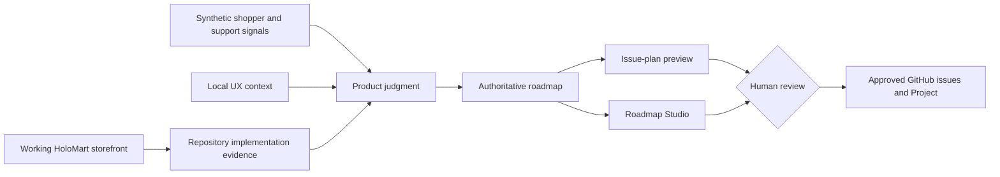

# HoloMart · Copilot for Product demo kit

## Product Track: From Repo Insight to Roadmap Action

HoloMart is a fictional e-commerce marketplace for Pokémon TCG singles. The working demo lets shoppers search synthetic card listings by Pokémon, expansion, and rarity; compare price, condition, seller reputation, and market context; add cards to a demo cart; export the catalog; and save searches in the current browser.

The product story deliberately stops at an honest boundary: **Saved Searches works locally, but account sync and price alerts do not exist yet.** The demo uses GitHub Copilot to answer three product questions from repository evidence:

1. What is already built?
2. What could break or mislead shoppers?
3. What work and decisions come next?

> **Safety and provenance:** HoloMart, every listing, price, seller, rating, quote, metric, and roadmap item is **SYNTHETIC / DEMO-ONLY**. Pokémon names are used only to illustrate the marketplace concept. No card artwork, real customer data, credentials, payment details, or production integrations are included.

## Quick start

Requirements: Git, Node.js 20+, npm, and the GitHub Copilot app/CLI.

```powershell
node --version
npm run demo:check
npm start
```

Open <http://127.0.0.1:4173>.

Useful commands:

```powershell
npm test
npm run validate
npm run issues:preview
npm run issues:preview:json
npm run demo:reset
```

## Demo narrative

The current storefront makes the product scenario concrete:

- Collectors repeatedly rebuild narrow card searches while inventory and price change.
- A browser-local shortcut reduces setup and is intentionally visible as a preview.
- Stale expansion or rarity criteria can undermine trust if recovery is silent.
- Account sync creates durable-data lifecycle work.
- Price alerts require separate evidence, freshness rules, and explicit notification consent.



## 45-minute map

| Time | Move | Proof |
| --- | --- | --- |
| 0–5 | Frame the collector problem in the working storefront | `app/`, `product/brief.md` |
| 5–13 | Ask what Saved Searches already implements | cited code/test capability matrix |
| 13–21 | Use evidence to sharpen scope and non-goals | `product/evidence/`, spec |
| 21–29 | Review responsive, accessible, and recovery states | `design/` |
| 29–37 | Preview an epic and dependency-ordered work | issue generator |
| 37–42 | Explore Now/Next/Later in Roadmap Studio | `product/roadmap.json` |
| 42–45 | Close on human-owned product decisions | explicit gates |

The complete run-of-show is in [the facilitator guide](docs/facilitator-guide.md), with copy/paste prompts in [the hands-on-keyboard pack](docs/hands-on-keyboard-prompts.md).

## Starter prompts

```text
/repository-feature-assessment Is HoloMart Saved Searches half-built, what will it break, and how big is it?
```

```text
/evidence-to-spec Sharpen the device-local Saved Searches preview around stale criteria, accessibility, and explicit non-goals. Stop at the evidence checkpoint.
```

```text
/figma-ux-review Review Saved Searches, listing trust context, empty states, and recovery using the committed local design fallback.
```

```text
/epic-subissue-draft init-saved-searches-preview
```

```text
Reload extensions from disk, then open Roadmap Studio using product/roadmap.json focused on init-saved-searches-preview. Draft a read-only handoff.
```

If custom commands are unavailable, name the corresponding file in `.github/prompts/` and paste the sentence after the command name as a normal prompt.

## Product artifacts

| Path | Role |
| --- | --- |
| `app/`, `src/`, `test/` | Working storefront, catalog, Saved Searches implementation, and tests |
| `product/brief.md` | Product, users, strategy, goals, constraints, and measures |
| `product/saved-searches-spec.md` | Deliberately incomplete feature specification |
| `product/evidence/` | Synthetic shopper, support, usage, and market signals |
| `product/roadmap.json` | Authoritative five-initiative roadmap |
| `design/` | Authentication-free UX brief, design context, and tokens |
| `.github/prompts/`, `agents/`, `skills/` | Evidence-disciplined Copilot workflows |
| `.github/extensions/roadmap-studio/` | Interactive read-only roadmap canvas |
| `scripts/roadmap-to-issues.mjs` | Deterministic epic and child-issue preview |

## Roadmap

The authoritative roadmap includes:

| Horizon | Initiative |
| --- | --- |
| Now | Harden personal Saved Searches preview |
| Now | Make listing trust signals easier to compare |
| Next | Evaluate account-synced Saved Searches |
| Next | Research explicit price-drop alerts |
| Later | Explore collection and wishlist lists |

Now/Next/Later are planning horizons, not promises. Every initiative preserves evidence limitations, risks, guardrails, dependencies, and unresolved human decisions.

## Working boundaries

- Saved Searches persists only in `localStorage` on the current browser.
- Saving does not create an account record or a notification subscription.
- Synthetic market price is context, not a guarantee or appraisal.
- Card visuals are abstract CSS treatments; no copyrighted card artwork is bundled.
- The issue generator remains preview-only. Real remote changes require explicit user direction and authenticated GitHub tooling.

## Operations

- Presenter preflight and reset: [demo operations](docs/demo-operations.md)
- Exact 45-minute script: [facilitator guide](docs/facilitator-guide.md)
- Copy/paste conversation ladder: [hands-on-keyboard prompts](docs/hands-on-keyboard-prompts.md)
- Optional Figma setup: [Figma MCP](docs/figma-mcp.md)
- GitHub roadmap model: [GitHub Projects setup](docs/github-projects-setup.md)
