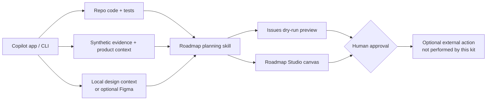

# Signal Desk · CSI Build Days presenter kit

## Product Track: Stop Waiting on Engineering

**“Stop Waiting on Engineering: Turning Repo Insight into Roadmap Action”** is a 45-minute, product-led demonstration of answering three questions directly from a repository:

1. Is it half-built?
2. What will it break?
3. How big is it?

The promise is not to turn PMs into engineers. It is to use GitHub Copilot to connect code reality, customer/market/backlog evidence, design context, and delivery planning—then keep people responsible for every product decision and external write.

**Audience:** PMs, product operations, designers/researchers, and engineering partners.

**Safety:** Signal Desk, every customer, quote, metric, date, and plan is **SYNTHETIC / DEMO-ONLY**. Do not paste real customer data, credentials, or private design content into the demo.

## The story

Signal Desk is a fictional feedback queue. Saved Views can already create, apply, and delete browser-local filter configurations, but reliability, recovery, accessibility, rename/update semantics, sync, and sharing are not all complete. The session turns that honest implementation boundary into a sharper spec, a reviewed issue preview, and a roadmap handoff.



## Prerequisites and quick start

- Git, Node.js **20+**, npm, and the GitHub Copilot app/CLI with repository access.
- Optional: GitHub CLI (`gh`) for an auth check only; no remote resource is needed.
- Optional: a separately reviewed and authenticated Figma MCP connection. The default demo uses committed local design artifacts.

From PowerShell at the repository root:

```powershell
node --version
npm run demo:check
npm start
```

Open <http://127.0.0.1:4173>. Keep the server terminal open. In another terminal, `npm run issues:preview` produces a deterministic preview and performs **no remote writes**.

## 45-minute demo map

| Time | Move | Proof |
| --- | --- | --- |
| 0–5 | Frame the PM questions and safety boundary | `product/brief.md` |
| 5–13 | Question the repo | cited implementation/dependency/test matrix |
| 13–21 | Pull evidence into a sharper spec | evidence/counter-evidence and open decisions |
| 21–29 | Review design | local artifacts by default; Figma only if already authenticated |
| 29–37 | Preview the handoff | epic + dependency-ordered child issues; no writes |
| 37–42 | Open Roadmap Studio | Now/Next/Later, focus, read-only handoff |
| 42–45 | Close on judgment | explicit product and write checkpoints |

Full speaker copy and recovery cuts: [facilitator guide](docs/facilitator-guide.md). For an on-stage, copy/paste conversation ladder plus role-based menus and 15/30/45-minute cuts, use the [hands-on-keyboard prompt pack](docs/hands-on-keyboard-prompts.md).

## Starter prompts

Paste these into the Copilot app from this repository:

The [hands-on-keyboard prompt pack](docs/hands-on-keyboard-prompts.md) expands these starters into a sequential, checkpointed flow spanning product discovery, UI/UX and accessibility, a safe live-code preview, issue/project planning, roadmap scenarios, Roadmap Studio, and stakeholder communication. It always includes plain-language fallbacks when repository prompt commands are not surfaced.

```text
/repository-feature-assessment Is Saved Views half-built, what will it break, and how big is it?
```

```text
/evidence-to-spec Sharpen the browser-local Saved Views preview around recovery, accessibility, and explicit non-goals. Stop at the evidence checkpoint.
```

```text
/figma-ux-review Review the Saved Views create, apply, delete, empty, and recovery states using the committed local design fallback. Do not assume Figma access.
```

```text
/epic-subissue-draft init-saved-views-preview
```

```text
Use the roadmap-planning skill for init-saved-views-preview. Keep every human decision flag open and stop at each checkpoint.
```

```text
Reload extensions from disk, then open Roadmap Studio using product/roadmap.json focused on init-saved-views-preview. Draft a read-only handoff; do not change the roadmap or create issues.
```

If custom prompt commands are not surfaced, paste the sentence after the command name as a normal prompt and name the corresponding file in `.github/prompts/`.

## Human checkpoints

1. **Repository interpretation:** confirm implemented/partial/missing classifications.
2. **Evidence and scope:** challenge synthetic claims, counter-signals, and non-goals.
3. **Design source:** explicitly choose supplied authenticated Figma context or the committed fallback.
4. **Roadmap selection:** confirm `init-saved-views-preview` and leave decision flags open.
5. **Issue preview:** inspect exact bodies, labels, ordering, and relationships.
6. **Remote write:** require new, immediate approval for each mutation. This demo stops before it.

## Roadmap, canvas, and issue preview

`product/roadmap.json` is authoritative. The `roadmap-planning` skill turns its stable `init-*` and `work-*` IDs into reviewed delivery work. Roadmap Studio is a project canvas under `.github/extensions/roadmap-studio`; ask Copilot to reload extensions, then use the final starter prompt above. It reads and validates the roadmap, filters/focuses initiatives, and drafts a read-only Product-to-Engineering handoff.

Canvas unavailable? Use `product/roadmap.json` plus:

```powershell
npm run issues:preview
npm run issues:preview:json
node scripts/roadmap-to-issues.mjs --initiative init-saved-views-preview --gh-commands
```

The last command **prints** PowerShell commands; do not run them during this demo. For optional Figma setup, read [Figma MCP](docs/figma-mcp.md); the safe default is `design/local-design-context.json`, `design/saved-views-ux-brief.md`, and `design/tokens.json`.

## Repository map

| Path | Role |
| --- | --- |
| `app/`, `src/`, `test/` | working Signal Desk UI, implementation facts, and tests |
| `product/` | brief, incomplete spec, decisions, synthetic evidence, authoritative roadmap |
| `design/` | UX brief, tokens, and authentication-free local design context |
| `.github/agents/`, `instructions/`, `prompts/` | evidence-disciplined Copilot workflows |
| `.github/skills/roadmap-planning/` | reviewed roadmap-to-delivery workflow |
| `.github/ISSUE_TEMPLATE/` | discovery, epic, and design-review intake |
| `.github/extensions/roadmap-studio/` | Roadmap Studio canvas |
| `scripts/` | local server, validation, safe reset guidance, and dry-run generator |

## Operate and validate

- Preflight, reset, ports, extension reload, and offline fallbacks: [demo operations](docs/demo-operations.md)
- Exact 45-minute run-of-show: [facilitator guide](docs/facilitator-guide.md)
- Copy/paste prompt ladder and role menus: [hands-on-keyboard prompt pack](docs/hands-on-keyboard-prompts.md)
- Optional official Figma MCP path: [Figma MCP](docs/figma-mcp.md)
- Manual GitHub Projects model: [GitHub Projects setup](docs/github-projects-setup.md)

```powershell
npm run validate
npm test
npm run demo:check
npm run demo:reset
```

If you started the app with an alternate `PORT`, reuse the same value for `npm run demo:reset` so the reset checklist matches the browser origin.
