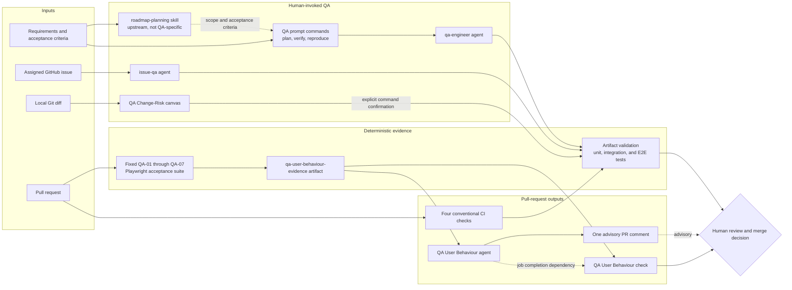

# HoloMart QA architecture

> **SYNTHETIC / DEMO-ONLY.** This page describes committed repository mechanics and local fixture-based QA. It is not evidence of real shopper outcomes, production readiness, or a defect-free product. No product-evidence source IDs are used here; every implementation claim is tied to repository `path:line` evidence.

HoloMart uses several QA surfaces for different moments in delivery. Prompts and agents help people plan, reproduce, and interpret. The QA Change-Risk canvas assesses a local diff before review. Conventional tests and CI provide repeatable checks. The pull-request agentic workflow adds a fixed browser acceptance check plus an advisory agent comment. None of these removes the final human decision.

## Architecture

Solid arrows represent execution or evidence flow. Dotted arrows represent context or advice. In particular, the agent comment cannot change the fixed acceptance result: the workflow says the conventional Playwright suite is the only source of the merge-gating conclusion (`.github/workflows/qa-user-behaviour.md:557-574`), and the check job derives success only when all seven validated cases pass (`.github/workflows/qa-user-behaviour.md:475-553`).

## QA component map

| Surface | Responsibility | Mutation boundary | Pipeline position | Repository evidence |
| --- | --- | --- | --- | --- |
| QA prompt commands | Give repeatable entry points for a test plan, change verification, or defect reproduction and route all three to `qa-engineer`. | Analysis-only by default; the verification prompt permits test changes only when explicitly requested. | Requirements, development, and pre-PR verification. | `.github/prompts/qa-test-plan.prompt.md:1-28`, `.github/prompts/qa-change-verification.prompt.md:1-29`, `.github/prompts/qa-bug-reproduction.prompt.md:1-36` |
| `qa-engineer` | Performs risk-based planning, reproduction, change verification, regression-test work, and release checks. | May edit only `test/**` after explicit human authorization; it never edits production/configuration files or writes remotely. | Interactive local QA and bounded handoffs from another agent. | `.github/agents/qa-engineer.agent.md:13-39`, `.github/agents/qa-engineer.agent.md:41-65` |
| `issue-qa` | Treats an assigned issue as a test charter, traces acceptance criteria, reproduces defects, and reports a verdict. | Defaults to verification-only. Tests or a production fix require explicit issue authorization; unrelated remote resources remain out of scope. | Issue implementation and issue-scoped verification, usually before or while preparing a PR. | `.github/agents/issue-qa.agent.md:1-10`, `.github/agents/issue-qa.agent.md:21-31`, `.github/agents/issue-qa.agent.md:93-120` |
| QA Change-Risk canvas | Reads local Git evidence, maps changed paths to capabilities, infers risks, proposes automated/manual checks, records results, and exports a local summary. | Runs only existing allowlisted commands after an exact-command preview and confirmation; state stays in session artifacts and release remains a human decision. | Local pre-PR and review preparation. | `.github/extensions/qa-change-risk/extension.mjs:94-123`, `.github/extensions/qa-change-risk/model.mjs:755-839`, `.github/extensions/qa-change-risk/model.mjs:891-965`, `.github/extensions/qa-change-risk/extension.mjs:307-331`, `.github/extensions/qa-change-risk/model.mjs:1215-1223` |
| QA User Behaviour agentic workflow | Runs seven fixed browser journeys, preserves their result artifact, lets an agent clarify failures or add advisory observations, and publishes one safe PR comment. | Repository edits are disabled; the agent cannot reinterpret fixed statuses. The generated check fails closed when evidence is missing, malformed, incomplete, or non-passing. | Automatic pull-request QA. | `.github/workflows/qa-user-behaviour.md:1-57`, `.github/workflows/qa-user-behaviour.md:79-185`, `.github/workflows/qa-user-behaviour.md:557-598` |
| Conventional test and CI workflows | Run artifact validation, unit coverage, integration coverage, and Chromium E2E checks as independent jobs. | Read-only repository checkout; artifacts contain coverage or failure evidence. | Push and pull-request quality baseline. | `.github/workflows/ci.yml:1-36`, `.github/workflows/unit-tests.yml:1-41`, `.github/workflows/integration-tests.yml:1-41`, `.github/workflows/e2e-tests.yml:1-47` |
| Skills | The required `roadmap-planning` skill can create upstream scope, acceptance, validation, dependencies, and human checkpoints. It is not a QA executor. | Preview-only until explicit remote-write approval. | Before QA, where product scope becomes testable delivery work. | `scripts/validate-artifacts.mjs:40-45`, `.github/skills/roadmap-planning/SKILL.md:1-14`, `.github/skills/roadmap-planning/SKILL.md:23-84` |

### Prompts, agents, skills, and workflows are different

- A **prompt** is a named, reusable request. The three `/qa-*` prompts select `qa-engineer` in frontmatter and narrow its task (`.github/prompts/qa-test-plan.prompt.md:1-6`, `.github/prompts/qa-change-verification.prompt.md:1-6`, `.github/prompts/qa-bug-reproduction.prompt.md:1-6`).
- An **agent** owns role, tools, operating modes, and mutation limits. `qa-engineer` is intentionally test-only when editing, while `issue-qa` can enter a narrowly authorized fix-and-verify mode (`.github/agents/qa-engineer.agent.md:13-39`, `.github/agents/issue-qa.agent.md:21-31`).
- A **skill** supplies reusable domain procedure that can be invoked across requests. The current validated required-file set lists roadmap planning and no QA-specific skill (`scripts/validate-artifacts.mjs:40-45`, `.github/skills/roadmap-planning/SKILL.md:1-14`).
- An **agentic workflow** is pull-request automation. It combines conventional setup and fixed acceptance code with a constrained agent that explains results through a safe output (`.github/workflows/qa-user-behaviour.md:59-185`, `.github/workflows/qa-user-behaviour.md:557-586`).
- A **canvas extension** is an interactive local UI backed by deterministic code. QA Change-Risk exposes refresh, plan, manual-result, and export actions, and runs a loopback-only server for its panel (`.github/extensions/qa-change-risk/extension.mjs:731-824`, `.github/extensions/qa-change-risk/extension.mjs:868-995`).

**Missing from the validated QA surface:** there is no dedicated QA `SKILL.md` in the required artifact set. QA reuse is presently implemented through prompts, the two agent definitions, the canvas, and the PR workflow. Adding a QA skill is a future human-owned design choice; it should not duplicate the existing agent policies.

## How QA fits into the delivery pipeline

### 1. Product scope becomes testable criteria

The roadmap-planning skill can frame approved work, acceptance criteria, validation, dependencies, and unresolved decisions before implementation (`.github/skills/roadmap-planning/SKILL.md:57-84`). This is an upstream handoff, not proof that behavior is implemented or tested.

### 2. Interactive QA selects the smallest specialist path

| Need | Entry point | Expected output |
| --- | --- | --- |
| Turn requirements into prioritized coverage | `/qa-test-plan` | Scope, risk matrix, coverage trace, cases, exact commands, and unknowns; no edits (`.github/prompts/qa-test-plan.prompt.md:19-28`). |
| Verify a local change | `/qa-change-verification` | Pass, fail, partial, or blocked verdict with acceptance trace and residual risk (`.github/prompts/qa-change-verification.prompt.md:20-29`). |
| Reproduce one defect report | `/qa-bug-reproduction` | Reproduced, not reproduced, intermittent, or blocked with exact evidence (`.github/prompts/qa-bug-reproduction.prompt.md:10-36`). |
| Add regression coverage | Select `qa-engineer` and explicitly authorize test edits | Deterministic changes under `test/**` only (`.github/agents/qa-engineer.agent.md:15-20`, `.github/agents/qa-engineer.agent.md:60-65`). |
| Work an assigned issue | Select or assign `issue-qa` | Issue-scoped QA verdict and, only when authorized, tests or the smallest fix (`.github/agents/issue-qa.agent.md:21-31`, `.github/agents/issue-qa.agent.md:102-120`). |

### 3. Local diff review adds risk and test selection

QA Change-Risk:

1. Reads the working tree plus an optional local comparison base and records exact changed paths and line hunks (`.github/extensions/qa-change-risk/model.mjs:982-1005`).
2. Maps paths to configured product and workflow capabilities, then labels inferred risk as inference rather than a confirmed defect (`.github/extensions/qa-change-risk/repo-config.mjs:40-206`, `.github/extensions/qa-change-risk/model.mjs:803-839`).
3. Produces existing automated checks, proposed coverage, and manual accessibility or exploratory checks (`.github/extensions/qa-change-risk/model.mjs:848-965`).
4. Requires a short-lived confirmation tied to the current assessment fingerprint before spawning any command (`.github/extensions/qa-change-risk/extension.mjs:307-331`, `.github/extensions/qa-change-risk/extension.mjs:617-677`).
5. Invalidates recorded evidence if the analyzed Git fingerprint changes and never turns completed evidence into automatic release approval (`.github/extensions/qa-change-risk/model.mjs:1109-1135`, `.github/extensions/qa-change-risk/model.mjs:1215-1223`).

### 4. Conventional automated checks establish the baseline

| Layer | Selection and command | CI behavior |
| --- | --- | --- |
| Artifact validation | `npm run validate`; `demo:check` also adds unit/integration tests and a deterministic issue preview (`package.json:7-21`). | Repository validation runs on pushes and PRs (`.github/workflows/ci.yml:1-36`). |
| Unit | `test/unit/**/*.test.js` through `npm run test:unit` (`vitest.unit.config.js:3-17`, `package.json:9-13`). | Runs with coverage and uploads `coverage/unit` (`.github/workflows/unit-tests.yml:29-41`). |
| Integration | `test/integration/**/*.test.js` through `npm run test:integration` (`vitest.integration.config.js:3-17`, `package.json:9-13`). | Runs with coverage and uploads `coverage/integration` (`.github/workflows/integration-tests.yml:29-41`). |
| End to end | `test/e2e` through `npm run test:e2e`; Playwright starts the local server and retains failure media (`playwright.config.js:3-30`, `package.json:14-15`). | Installs Chromium, runs E2E, and uploads failure artifacts (`.github/workflows/e2e-tests.yml:29-47`). |

`npm test` runs unit then integration; `npm run test:all` adds E2E (`package.json:9-15`). Agents should start with the smallest relevant established command and broaden only when evidence requires it (`.github/agents/qa-engineer.agent.md:43-59`).

### 5. Pull requests add fixed user-behaviour QA

The `QA User Behaviour` workflow runs only for PR open, synchronize, reopen, and ready-for-review events and disables repository editing in the Copilot engine (`.github/workflows/qa-user-behaviour.md:1-19`). Its flow is:

1. Start HoloMart locally and wait for `127.0.0.1:4173` (`.github/workflows/qa-user-behaviour.md:59-77`).
2. Run fixed Playwright cases `QA-01` through `QA-07`, write `results.json` and `report.md`, and upload the evidence artifact (`.github/workflows/qa-user-behaviour.md:79-185`, `.github/workflows/qa-user-behaviour.md:427-434`).
3. Let the constrained agent read those files, clarify failures with Playwright CLI when necessary, add clearly advisory observations, and publish exactly one safe PR comment (`.github/workflows/qa-user-behaviour.md:563-586`).
4. After the agent job completes, validate that the artifact contains each fixed case exactly once with a valid status and non-empty evidence, then create a success/failure check from those results (`.github/workflows/qa-user-behaviour.md:449-553`).

The source of truth is `.github/workflows/qa-user-behaviour.md`. Its `.lock.yml` is generated and must not be hand-edited; update the Markdown source and run `gh aw compile` (`.github/workflows/qa-user-behaviour.lock.yml:1-24`).

### 6. A human makes the release or merge decision

The canvas stops at `Evidence complete: human sign-off required` even when every planned item is complete (`.github/extensions/qa-change-risk/model.mjs:1215-1223`). Agents also require explicit authority before edits or remote writes (`.github/agents/qa-engineer.agent.md:15-29`, `.github/agents/issue-qa.agent.md:21-31`). Repository settings determine whether any published check is required for merge; that branch-protection configuration is external to this repository and is therefore **unknown** here.

## Current limitations and maintenance risks

| Status | Limitation | Evidence and impact |
| --- | --- | --- |
| Partial | QA Change-Risk's targeted-test map names several legacy root-level paths such as `test/saved-searches.test.js`, while the active Vitest suites select `test/unit/**` and `test/integration/**`. | The canvas can still recommend full `npm test` or validation, but current targeted recommendations do not cover every active suite path (`.github/extensions/qa-change-risk/repo-config.mjs:5-38`, `vitest.unit.config.js:4-8`, `vitest.integration.config.js:4-8`). |
| Partial | The QA Change-Risk extension has a `node:test` suite at `test/qa-change-risk.test.js`, but that root-level file is outside both Vitest include globs and no package script invokes it. | The extension's own tests are not part of the documented `npm test` or the three test CI workflows (`test/qa-change-risk.test.js:1-31`, `package.json:7-17`, `vitest.unit.config.js:4-8`, `vitest.integration.config.js:4-8`). |
| Inferred risk | The fixed PR acceptance suite is embedded in the agentic workflow rather than shared with `test/e2e`, so the two browser suites can drift. | Keep journey changes synchronized between the inline fixed cases and Playwright E2E coverage (`.github/workflows/qa-user-behaviour.md:79-127`, `playwright.config.js:3-30`). |
| Missing | No QA-specific skill is listed in the validated required artifact set. | Prompts and agents provide reuse today; whether a separate skill would reduce duplication is unresolved human design work (`scripts/validate-artifacts.mjs:40-45`, `.github/skills/roadmap-planning/SKILL.md:1-14`). |
| Unknown | Required-check and branch-protection policy is not stored here. | A published check is not automatically proof that GitHub requires it before merge. |

## Maintenance map

| Change | Edit here | Follow-up |
| --- | --- | --- |
| QA role, authority, or verdict format | `.github/agents/qa-engineer.agent.md` or `.github/agents/issue-qa.agent.md` | Run `npm run validate`; the validator enforces QA prompt routing and the `qa-engineer` authority boundary (`scripts/validate-artifacts.mjs:269-310`). |
| Reusable QA command | `.github/prompts/qa-*.prompt.md` | Keep `agent: qa-engineer`; artifact validation checks that routing (`scripts/validate-artifacts.mjs:269-293`). |
| Local change-risk mapping or safe command | `.github/extensions/qa-change-risk/repo-config.mjs` and `model.mjs` | Run `node --test test/qa-change-risk.test.js`; command construction is allowlisted (`.github/extensions/qa-change-risk/repo-config.mjs:208-254`). |
| QA Change-Risk canvas lifecycle or UI | `.github/extensions/qa-change-risk/extension.mjs` or `renderer.mjs` | Run the extension test directly and visually review the canvas. |
| Fixed PR journey or agent report | `.github/workflows/qa-user-behaviour.md` | Run `gh aw compile`; never edit the generated lock by hand (`.github/workflows/qa-user-behaviour.lock.yml:1-24`). |
| Unit, integration, or E2E contract | `test/**`, the matching config, `package.json`, and `.github/workflows/*-tests.yml` | Run the smallest affected layer before the wider suite. |
